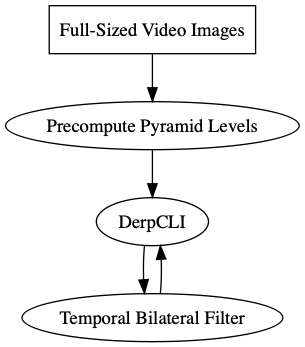
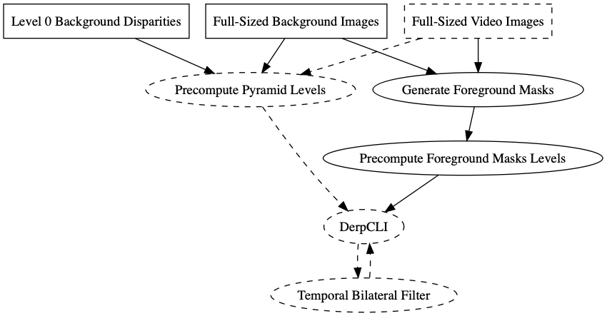
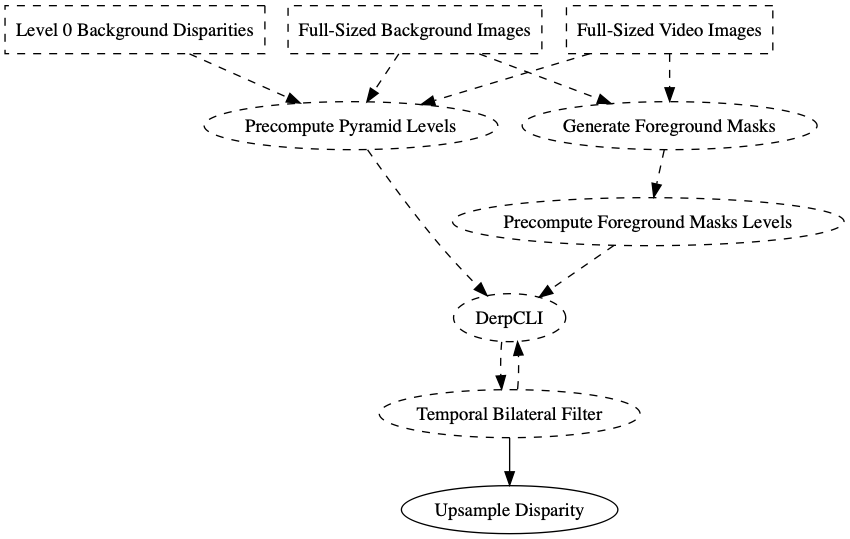
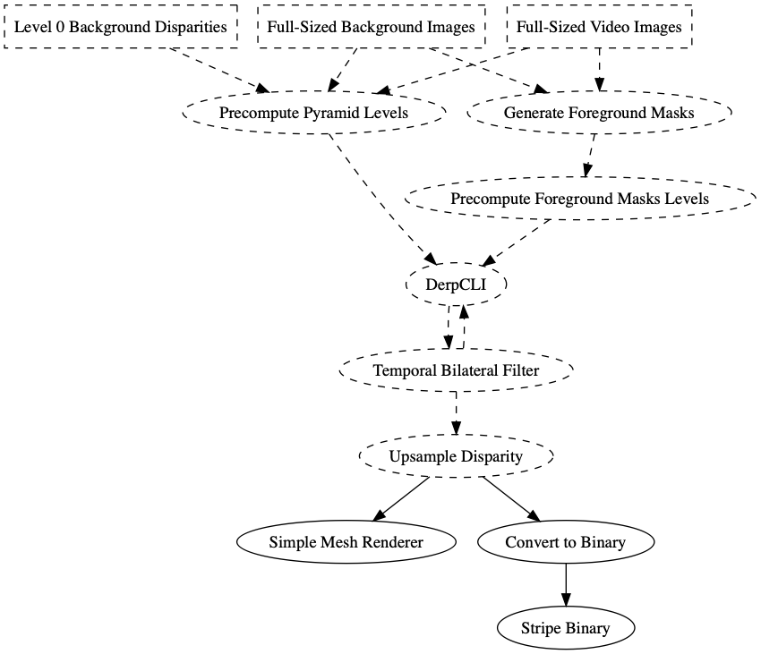

## Overview
The render pipeline offers flexibility for arbitrary render workflows. Some common scenarios are detailed below, based on what input data is available and what outputs are desired.

## Without Background
If no background image is available depth estimation is performed on the entire image for each camera. This method can used to render the background itself, or to get an idea of what the final render can look like.
Note that this reduces the speed and accuracy of the result.

## With Background
To improve the speed and accuracy of the results a background image of the empty scene can be. This is the recommended workflow and should produce results on par with those in our sample rendered datasets.

## Upsampled
Sometimes a per-camera disparity resolution greater than 2048 is desired. This is usually useful
for generating some of the non-6DoF output formats (e.g. equirect disparity). In this case,
an additional upsampling step is performed. This is recommended only if rendering a high
resolution non-6DoF where high resolutions are available at input (i.e. input color images exceeding 2048 resolution).

## Multiple Outputs
After producing the disparity maps multiple 6DoF and non-6DoF outputs can be produced using the steps found in the [Render](/docs/render) section.

